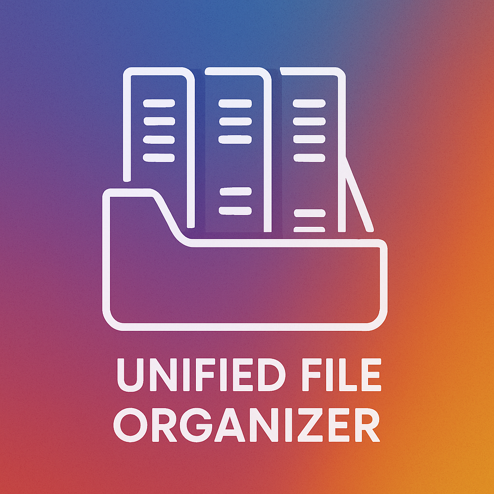

# Unified File Organizer



A powerful, all-in-one file organization solution designed to keep your digital life tidy and efficient. The Unified File Organizer combines multiple organization tools into a single, user-friendly interface.

## Features

### 1. Personal File Organizer
- Automatically sort and organize personal files
- Customizable organization rules
- Support for all common file types
- Duplicate file detection

### 2. Office File Organizer
- Specialized tools for office documents (Word, Excel, PowerPoint, PDFs)
- Document categorization
- Batch processing capabilities
- Metadata-based organization

### 3. Media Organizer
- Photo and video organization
- Date-based sorting
- Format conversion options
- Thumbnail previews

## System Requirements

- Windows 10/11 (64-bit)
- Python 3.8 or higher
- 4GB RAM minimum (8GB recommended)
- 100MB free disk space

## Installation

### Option 1: Using the Installer (Recommended)
1. Download the latest `UnifiedFileOrganizerSetup.exe` from the releases page
2. Run the installer and follow the on-screen instructions
3. Launch the application from the Start Menu or Desktop shortcut

### Option 2: Manual Installation
1. Ensure Python 3.8+ is installed
2. Clone this repository:
   ```
   git clone https://github.com/yourusername/unified-file-organizer.git
   ```
3. Install the required dependencies:
   ```
   pip install -r requirements.txt
   ```
4. Run the application:
   ```
   python UNIFIED_organizer.py
   ```

## Usage

1. Launch the application
2. Select the type of organization you need (Personal, Office, or Media)
3. Choose the source directory to organize
4. Configure any specific organization rules
5. Click "Organize" to start the process
6. Review the results and confirm changes

## Customization

You can customize the organization rules by editing the configuration files in the `config` directory. Each organizer has its own settings file that can be modified to suit your needs.

## Building from Source

To build the application from source:

1. Install PyInstaller:
   ```
   pip install pyinstaller
   ```
2. Run the build script:
   ```
   .\build_installer.bat
   ```
3. The installer will be created in the `dist` directory

## Contributing

Contributions are welcome! Please read our [Contributing Guidelines](CONTRIBUTING.md) for details on how to contribute to this project.

## License

This project is licensed under the MIT License - see the [LICENSE](LICENSE) file for details.

## Support

For support, please open an issue in the GitHub repository or contact us at support@unifiedorganizer.com

## Acknowledgements

- Built with PyQt6 for the modern UI
- Uses various Python libraries for file handling and organization
- Icons by [Icons8](https://icons8.com)

---

© 2025 Unified File Organizer | All Rights Reserved
